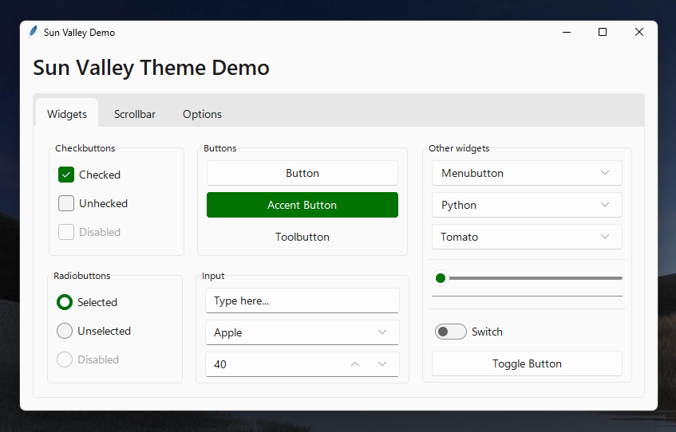
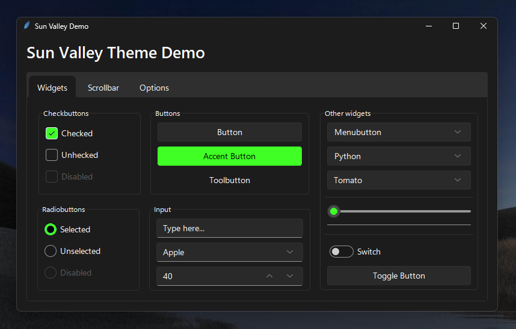

<div align="center">
  
# Sun Valley ttk theme
Make your Tkinter application look better than ever with just two lines of code! Now with accent color support and dark mode titlebars (only on Windows)!




</div>

> [!WARNING]
> This branch is just an experiment! It isn't intended for production use. Your app may start a bit slower, because the spritesheets will be colorized with your accent color at runtime. Also, the controls may not be colorized with your accent color completly. Use this version at your own risk.

## Installation [](https://pypi.org/project/sv-ttk)
Clone this repository. After that open the `sv_ttk` folder in your terminal (Command Prompt) run the following command:

```
pip install -r requirements.txt
```

This command will install all the necesary dependencies.

Finally, copy the `sv_ttk` folder to your project. You don't have to do any changes to your code.


## Usage [](https://github.com/rdbende/Sun-Valley-ttk-theme/wiki/Usage-with-Python)
> [!NOTE]
> The theme will only be applied to themable (`tkinter.ttk`) widgets, and not with the regular Tkinter widgets, they only benefit from the colorscheme.

For detailed documentation, visit the [wiki page](https://github.com/rdbende/Sun-Valley-ttk-theme/wiki/Usage-with-Python).

```python
import tkinter
from tkinter import ttk

import sv_ttk

root = tkinter.Tk()

button = ttk.Button(root, text="Click me!")
button.pack()

# This is where the magic happens
sv_ttk.set_theme("dark")

root.mainloop()
```


## Tips and tricks
Our intention is to keep the `sv-ttk` package as simple as possible, while making it easy to integrate with other libraries.

### Set the theme to the system theme
You can use the [darkdetect](https://github.com/albertosottile/darkdetect) package to detect the system color scheme. Here's an example:

```python
import darkdetect

sv_ttk.set_theme(darkdetect.theme())
```

It's only a matter of an extra import and passing the result of `darkdetect.theme()` to `sv_ttk.set_theme()`. It's that easy!


### Dark mode title bar on Windows
Already there.
